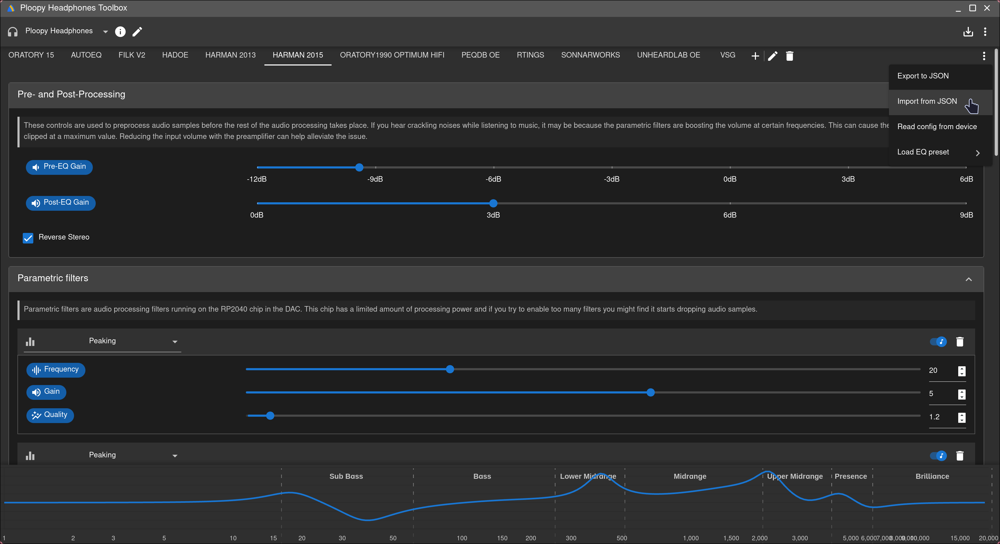
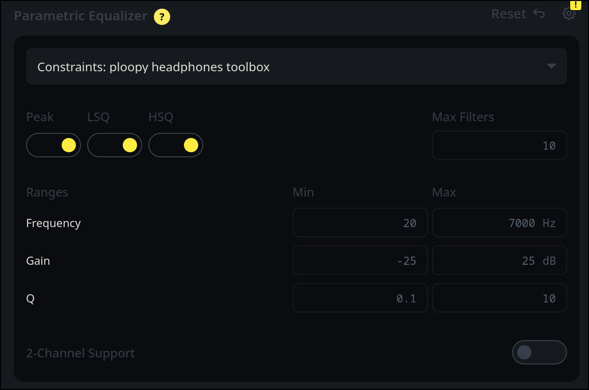
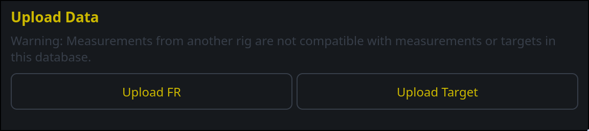
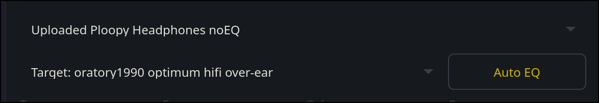
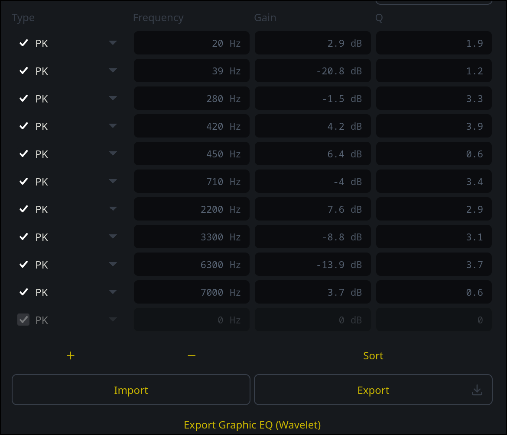

# Ploopy-Headphones-EQ-curves
A repository of EQ profiles and Curves for the Ploopy Headphones for use with the Headphones Toolbox

## How To import an EQ profile json

1. Open Ploopy Headphones Toolbox

2. press the 3 dot menu that is below the other one

3. press Import from JSON( see image if you can't find it )

## How To make your own Parametric EQ profile for Ploopy Headphones on squig.link

1. Set the settings for autoEQ like this
settings for autoEQ on [squig.link](https://squig.link)

| settings name | value |
| --- | --- |
| Max Filters | 10 |
| Frequency | 20hz to 7000hz |
| Gain | -25dB to 25dB |
| Quality/Q | 0.1 to 10.0 |

2. Import the Ploopy Headphones noEQ.csv by clicking the upload FR button

3. Import the target curve by clicking the upload Target button( see previous screenshot )

4. Set the target to the uploaded target curve name and the dropdown above to the Ploopy Headphones noEQ

5. press the autoEQ button( see previous screenshot )

6. hit the export button

7. make a new profile in Ploopy Headphones Toolbox

8. manually input the PEQ filters from the exported text file, don't forget the preamp!!

## CREDITS
Super* Review for [Squig.link](https://squig.link)

oratory1990 for default tuning of Ploopy headphones

jaakkopasanen for autoEQ profile for Ploopy Headphones, and for default none EQ curve

### curves
Filk for filk curve

Hadoe for Hadoe curve

VSG for VSG curve

Dung Le for Rtings, Sonnarworks Reference curves, and for Antdroid, Bad Guy, Banbeucmas, Crinacle, Precogvision, Super Review reviewer preference curves

jaakkopasanen for reference target CSV files

